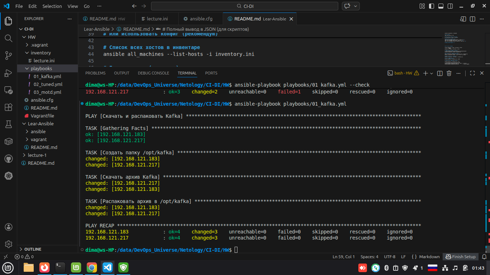
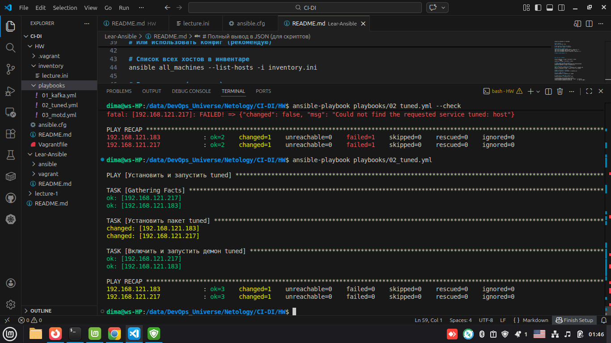
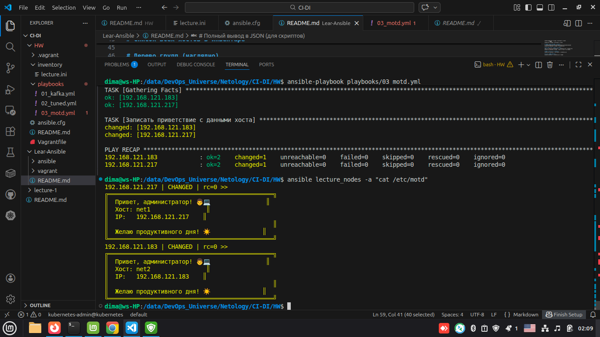
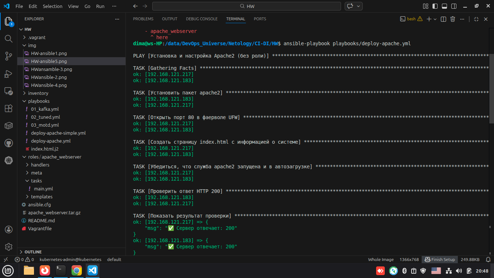
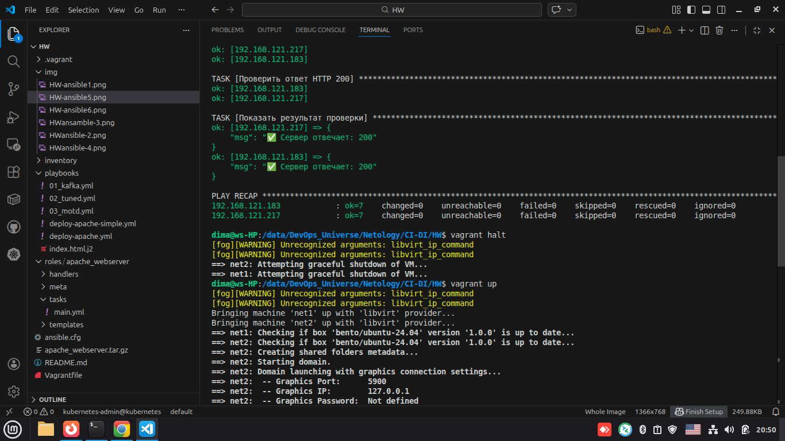

# Домашняя работа по Ansible

Студент: **Герасин Дмитрий Сергеевич**  
Курс: Netology, CI/CD  
Дата: 15.02.2026

---

## 📁 Структура проекта

```
homework-ansible/
├── ansible.cfg                 # Конфигурация Ansible
├── inventory/
│   └── lecture.ini            # Инвентарь хостов
├── playbooks/                 # Плейбуки заданий
│   ├── 01_kafka.yml
│   ├── 02_tuned.yml
│   ├── 03_motd.yml
│   ├── deploy-apache.yml      # С ролью
│   └── deploy-apache-simple.yml
├── roles/
│   └── apache_webserver/      # Роль для развёртывания Apache
│       ├── tasks/main.yml
│       ├── handlers/main.yml
│       ├── templates/index.html.j2
│       └── meta/main.yml
├── Vagrantfile                # Определение ВМ для тестирования
├── run-cluster.sh             # Скрипт запуска кластера + плейбука
└── README.md                  # Этот файл
```

---

## 🧪 Требования

- Vagrant + Libvirt/KVM
- Ansible ≥ 2.10
- ОС хоста: Linux (проверялось на Linux Mint/Ubuntu)

---

## 🚀 Запуск

```bash
# 1. Запустить ВМ и применить плейбук
./run-cluster.sh

# 2. Или по шагам:
vagrant up
ansible-playbook -i inventory/lecture.ini playbooks/deploy-apache.yml
```

---

## ✅ Задание 1: Три плейбука

### 01_kafka.yml
Скачивает архив Kafka с официального зеркала, создаёт `/opt/kafka`, распаковывает с проверкой идемпотентности (`creates`).



### 02_tuned.yml
Устанавливает пакет `tuned`, запускает демон и добавляет в автозагрузку через модуль `systemd`.



### 03_motd.yml
Меняет приветствие системы через переменную `motd_message`:

```yaml
vars:
  motd_message: "Добро пожаловать в мир автоматизации! 🚀\nСегодня {{ ansible_date_time.date }}\n"
```


---

## ✅ Задание 2: Расширенное приветствие

Модифицированный плейбук выводит хостнейм, IP-адрес и пожелание администратору через факты Ansible:

```jinja2
Хост: {{ ansible_hostname }}
IP:   {{ ansible_default_ipv4.address }}
```



---

## ✅ Задание 3: Роль для Apache

Создана роль `apache_webserver` со структурой:

```
roles/apache_webserver/
├── tasks/main.yml
├── handlers/main.yml
├── templates/index.html.j2
└── meta/main.yml
```

### Особенности:
- Установка `apache2` через `apt`
- Открытие порта 80 через `ufw`
- Генерация `index.html` через шаблон Jinja2 с использованием фактов:
  - CPU: `{{ ansible_processor_vcpus }}`
  - RAM: `{{ (ansible_memtotal_mb / 1024) | round(1) }} ГБ`
  - Диск: определение по корневому разделу
  - IP: `{{ ansible_default_ipv4.address }}`
- Handler `restart apache2` срабатывает только при изменении шаблона
- Проверка доступности через модуль `uri` (статус 200)





---

## 📦 Архив роли

Роль упакована в архив:
```bash
tar -czf apache_webserver.tar.gz roles/apache_webserver/
```

Файл: [`apache_webserver.tar.gz`](https://drive.google.com/file/d/1Pre1cwkhsmxVi4DkY5YZQENE2LHg887a/view?usp=drive_link)

---

## ⚠️ Важно

- Не используются модули `shell` и `command` — соблюдён принцип идемпотентности.
- Все плейбуки запускались дважды — во второй раз `changed=0`.
- Для `/etc/motd` рекомендуется использовать `/etc/motd.d/99-custom` на современных системах.